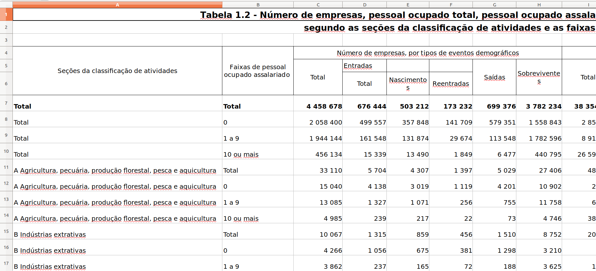

```{r setup, include=FALSE}
knitr::opts_chunk$set(echo = FALSE)
```

# The faces of data

## What do we mean when we say 'data'?

\centering\huge
Data are a representation of information.


##  What a user of data wants

\begin{center}
  \begin{tabular}{rl}
    \multicolumn{2}{l}{CO$_2$ emission (fictional)}\\
    \hline
    \textbf{fuel}    & \textbf{emission}\\
    \hline
    \multicolumn{1}{l}{Petrol}      & 215 \\
    -- of which bio                  & \phantom{0}75  \\
    \multicolumn{1}{l}{Diesel}     & 456 \\
    -- of which bio                  & \phantom{0}89  \\ 
    \hline
  \end{tabular}
\end{center}


## Example: IBGE



\tiny Source: https://www.ibge.gov.br/en/statistics/economic/industry-and-construction/22733-demography-of-enterprises-and-statistics-of-entrepreneurship.html?=&t=resultados


## What an analyst wants

\begin{center}
  \begin{tabular}{rl}
    \hline
    \textbf{fuel}    & \textbf{emission}\\
    \hline
    \multicolumn{1}{l}{Petrol}      & 215 \\
    -- of which bio                  & \phantom{0}75  \\
    \multicolumn{1}{l}{Diesel}     & 456 \\
    -- of which bio                  & \phantom{0}89  \\ 
    \hline
  \end{tabular}
$\longrightarrow$
  \begin{tabular}{rrl}
    \hline
    \textbf{fuel}      & \textbf{type}  & \textbf{emission}\\
    \hline
    Petrol & regular  & 140 \\
    Petrol & bio      & \phantom{0}75\\
    Diesel& regular  & 367 \\
    Diesel& bio      & \phantom{0}89\\
    \hline
  \end{tabular}
\end{center}


##  What a web developer wants


```{}
        [{"fuel":"petrol","type":"regular","emission":140}, 
         {"fuel":"petrol","type":"bio","emission":75}, 
         {"fuel":"diesel","type":"regular","emission":367}, 
         {"fuel":"diesel","type":"bio","emission":89}]
```

## Example: IBGE

\small
```{}
[{"id":"1501","nome":"Belém","nivel":{"id":"7","nome":"Região metropolitana"}},
{"id":"2301","nome":"Fortaleza","nivel":{"id":"7","nome":"Região metropolitana"}},
{"id":"2601","nome":"Recife","nivel":{"id":"7","nome":"Região metropolitana"}},
{"id":"2901","nome":"Salvador","nivel":{"id":"7","nome":"Região metropolitana"}},
{"id":"3101","nome":"Belo Horizonte","nivel":{"id":"7","nome":"Região metropolitana"}},
{"id":"3301","nome":"Rio de Janeiro","nivel":{"id":"7","nome":"Região metropolitana"}},
{"id":"3501","nome":"São Paulo","nivel":{"id":"7","nome":"Região metropolitana"}},
{"id":"4101","nome":"Curitiba","nivel":{"id":"7","nome":"Região metropolitana"}},
{"id":"4301","nome":"Porto Alegre","nivel":{"id":"7","nome":"Região metropolitana"}}]
```

\normalfont

\hfill \tiny Source: https://servicodados.ibge.gov.br/api/v3/agregados/1705/localidades/N7


##  

```{}
        [{"fuel":"petrol","type":"regular","emission":140}, 
         {"fuel":"petrol","type":"bio","emission":75}, 
         {"fuel":"diesel","type":"regular","emission":367}, 
         {"fuel":"diesel","type":"bio","emission":89}]
```

\begin{center}
$\downarrow$

  \begin{tabular}{rrl}
    \hline
    \textbf{fuel}      & \textbf{type}  & \textbf{emission}\\
    \hline
    Petrol & regular  & 140 \\
    Petrol & bio      & \phantom{0}75\\
    Diesel& regular  & 367 \\
    Diesel& bio      & \phantom{0}89\\
    \hline
  \end{tabular}
\end{center}

## What a database designer sees

\begin{equation*}
\begin{tabular}{ll}
\multicolumn{2}{l}{Fuel}\\
\hline
\textbf{id} & \textbf{name}\\
\hline
11 & petrol  \\
12 & diesel \\
\hline
\end{tabular}\textrm{, }\:
%
\begin{tabular}{ll}
\multicolumn{2}{l}{Type}\\
\hline
\textbf{id} & \textbf{name}\\
\hline
1 & regular \\
2 & bio \\
\hline
\end{tabular}\textrm{, }\:
%
\begin{tabular}{llll}
\multicolumn{3}{l}{Emission}\\
\hline
\textbf{id} & \textbf{fuel} & \textbf{type} & \textbf{amount} \\
\hline
120 & 11 &1 &140\\
121 & 11 &2 &\phantom{0}75\\
123 & 12 &1 &367\\
124 & 12 &2 &\phantom{0}89\\
\hline
\end{tabular}
\label{eq:database}
\end{equation*}


## 

\begin{equation*}
\begin{tabular}{ll}
\multicolumn{2}{l}{Fuel}\\
\hline
\textbf{id} & \textbf{name}\\
\hline
11 & petrol  \\
12 & diesel \\
\hline
\end{tabular}\textrm{, }\:
%
\begin{tabular}{ll}
\multicolumn{2}{l}{Type}\\
\hline
\textbf{id} & \textbf{name}\\
\hline
1 & regular \\
2 & bio \\
\hline
\end{tabular}\textrm{, }\:
%
\begin{tabular}{llll}
\multicolumn{3}{l}{Emission}\\
\hline
\textbf{id} & \textbf{fuel} & \textbf{type} & \textbf{amount} \\
\hline
120 & 11 &1 &140\\
121 & 11 &2 &\phantom{0}75\\
123 & 12 &1 &367\\
124 & 12 &2 &\phantom{0}89\\
\hline
\end{tabular}
\label{eq:database}
\end{equation*}
\begin{center}
$\downarrow$

  \begin{tabular}{rrl}
    \hline
    \textbf{fuel}      & \textbf{type}  & \textbf{emission}\\
    \hline
    Petrol & regular  & 140 \\
    Petrol & bio      & \phantom{0}75\\
    Diesel& regular  & 367 \\
    Diesel& bio      & \phantom{0}89\\
    \hline
  \end{tabular}
\end{center}


## Summarizing

### Presentation

- Convey a (single) message
- Human-readable

### Analyses

- Reusable for (interactive) analyses
- Machine-readable, easy to manipulate

### Transport

- Machine-readable
- Generic, language-independent format

### Storage

- Create, Read, Update, Delete (CRUD)
- Consistent, without (implicit) duplicate information


\begin{picture}(0,0)
\put(250,100){\includegraphics{fig/dataforms.pdf}}
\end{picture}


## Examples of tools

\begin{picture}(0,0)
\put(130,-70){\includegraphics{fig/dataforms.pdf}}

\put(230, -85){\includegraphics[height=5mm]{fig/json.png}}
\put(245, -85){\includegraphics[height=5mm]{fig/xml.png}}

\put(150,-85){\includegraphics[height=5mm]{fig/sql.png}}
\put(125,-85){\includegraphics[height=5mm]{fig/hadoop.png}}

\put(150,35){\includegraphics[height=5mm]{fig/rlogo.png}}
\put(125,35){\includegraphics[height=2mm]{fig/stata.png}}
\put(125,20){\includegraphics[height=5mm]{fig/spss.png}}
\put(125,45){\includegraphics[height=3mm]{fig/sas.png}}

\put(220, 30){\includegraphics[height=5mm]{fig/excel.png}}
\put(245, 25){\includegraphics[height=7mm]{fig/tableau.png}}

\end{picture}


## Why choosing the right tool is important (NYT, 2013)

\begin{center}
\includegraphics[height=0.7\textheight]{fig/excel2.png}
\end{center}

\note{
Reinhart-Rogoff error
}

## Why choosing the right tool is important (Nature, 2019)

\begin{center}
\includegraphics[height=0.7\textheight]{fig/excel3.png}
\end{center}


## Why choosing the right tool is important (Science, 2016)

\begin{center}
\includegraphics[height=0.7\textheight]{fig/excel1.png}
\end{center}

\hfill\tiny Ziemann, Eren, El-Osta \textit{Genome Biology} \textbf{17} 177 (2016)

## Homework assignment

\centering
{\huge Google `excel disasters'}

and spend 30 minutes reading what you find


## How to recognize whether data is suited for analysis\footnote{Only for simple rectangular data sets}

### Boxes to tick

1. Does each row correspond to one entity?
2. Are all entities of the same type?
3. Is every entity represented only once?
4. Does every column correspond to a single property for each entity?
5. Are all elements of each column of the same and the correct type?
6. Is the data valid?

### Rule of thumb

Can you make meaningful summary statistics over each column?


## Not all data is 'simple rectangular'

\begin{picture}(0,0)
\put(0,0){\includegraphics[height=3cm]{fig/nsnet.pdf}}
\put(100,-25){\includegraphics[height=3cm]{fig/timeseries.png}}
\put(200,-50){\includegraphics[height=3cm]{fig/bdichtheid.png}}
\put(300,-75){\includegraphics[height=2cm]{fig/image.jpg}}

\put(0,-90){Each data type consists of particular basic elements and is
manipulated\\ with particular basic operations.}
\end{picture}


