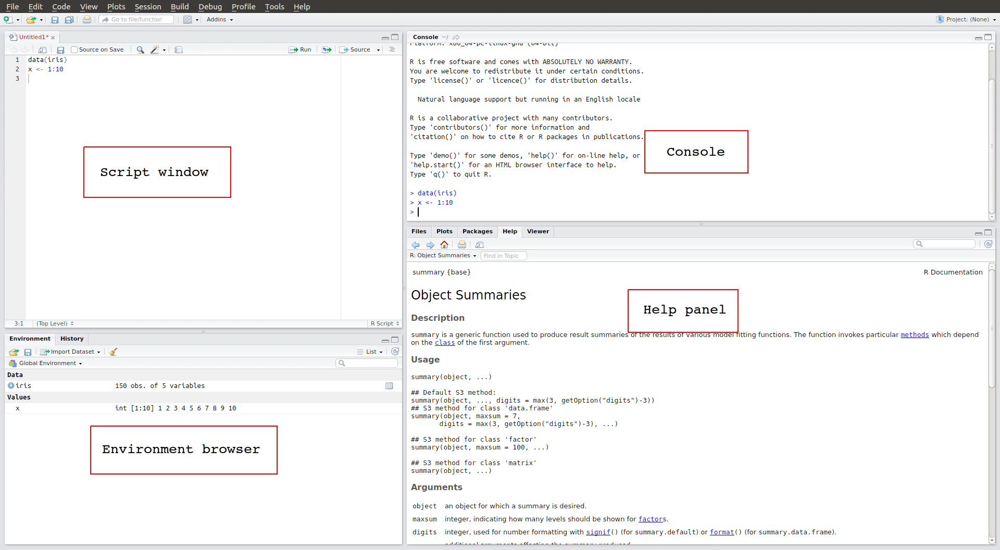
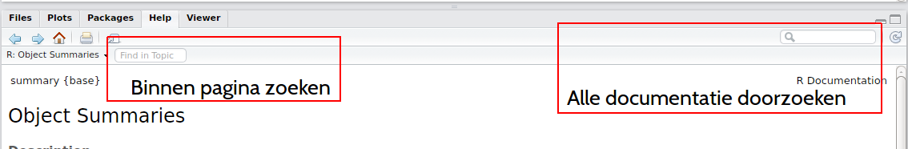

```{r,echo=FALSE}
knitr::opts_chunk$set(comment=NA)
```


## Contents, today's goal

- What is R, RStudio
- Working with command-line and scripts
- Data frames
- plots, summaries, basic data processing
- read/write csv files

# R and RStudio
 
## R and the R community

\begin{center}
\includegraphics[trim=140 150 140 150,clip=true]{fig/wordcloud.pdf}
\end{center}


## Good to remember

### R and R packages

- R is the program doing all the calculations. It is developed by the _R Core team_, consisting
of 20 scholars.
- Users can publish _R packages_ that add new functionality.


### RStudio

RStudio makes it much easier to work with R. It is a separate software, developed
by RStudio Inc.


## Citing R, citing packages

```{r, eval=FALSE, echo=TRUE}
# to cite R, type
citation()
# to cite R package 'validate', type:
citation("validate")
```


## Please download _and unzip_

Go to: \Large\texttt{github.com/markvanderloo/UFPEL2019}

\begin{center}
\includegraphics[height=0.7\textheight]{fig/download.jpg}
\end{center}


## RStudio




## Console

- Connects to the `R interpreter'
- You can type commands there or copy them from the script window
- Resultats are printed to the console again.

```{r}
1 + 1
```

## Script window

- Here you can open and edit several types of text files, e.g.
    - `.R`  (R scripts)
    - `.Rmd` to create reports that include your results
    - `C`/`C++` for programming with `C` or `C++`
- Use `CTRL-ENTER` to send the currently selected command to the R interpreter.
- The script window is the single most important place in RStudio! **WRITE ALL YOUR CODE IN SCRIPTS**.

## Environment browser

- Gives an interactive overview of all data loaded into R
    - data sets, results of modeling; anything really. 
- You can get the same overview by typing `ls()` in the command-line

## Help panel

- Help pages for each R function



- Open a help page for a function: `?<function>` or search: `??<search term>`. 

### Note


The help pages are pretty dense and technical. They are aimed to be
technical documentation, but don't be intimidated! There is lots of
help online.

## Getting help

- Q-and-A site `stackoverflow.com`
    - Easily found via Google.
    - `n00b`-friendly
- R-help mailinglist `r-project.org/mail.html`
    - You may get answers from the R-core developers.
    - DO READ THE POSTING GUIDE


### Tip of the day

Error message? Cut-and-paste it in Google.

## Literature

- Working with  R:
    - R in a Nutshell (J. Addler) _O'Reily_
    - R for data science (H. Wickham and G. Grolemund) _O'Reilly_
- Programming, package development:
    - The Art of R Programming (N. Matloff) _No Starch Press_
    - Testing R code (R. Cotton) _O'Reilly_
    - R Packages (H. Wickham) _O'Reilly_
    - Advanced R (H. Wichham) _CRC Press_
- Applications:
    - _Use R!_ series: `www.springer.com/series/6991`
    - _The R Series_ `crcpress.com/go/the-r-series`
    - $\ldots$
- See also `r-project.org/doc/bib/R-books.html`


# Basic data types and the R command-line

## Some tips

### Repeat commands

Use arrow keys $\uparrow$, $\downarrow$ to cycle through previous commands

### Keyboard shortcuts (in script window)

\begin{tabular}{ll}
\texttt{CTRL+ENTER}   & Execute current command\\
\texttt{CTRL-SHIFT-S} & Execute current script
\end{tabular}

### Auto-complete

Use `tab` to complete names of objects, columns in `data.frames` and file names
(between quotes).

## Vectors

The basic unit in R is a _vector_: a sequence of values of the same type
(like a column of data in SAS or SPSS --but not Excel!).


## Example

```{r, fig.height=4}
# Sample 100 numbers from the normal distribution 
# Store under the name 'x'
x <- rnorm(100)
# plot a histogram of x
hist(x, breaks=20)
```

## Example (cont'd) statistical summaries.

```{r}
summary(x) # overview
sd(x)      # standard deviation
head(x,3)  # first three values
```

## Example (cont'd) metadata

```{r}
length(x)
class(x)
y <- c(joe=1, bill=7, averett=3)
names(y)
```


## Some observations

- You can create and name vectors under (almost) any name. Use `<-` to store something
under a given name.
- You do calculations with _functions_, like `sd`, `min`, `mean`
- When a vector is printed, the first column in the terminal shows the position.


\begin{center}
\includegraphics{fig/rstudio5.png}
\end{center}

## Creating vectors

\begin{tabular}{ll}
\texttt{c(...)}               & Assign value by value (\texttt{x <- c(1,6,2)})\\
\texttt{seq(from, to, [by])}  & Create a sequence (\texttt{x <- seq(1,10,2)})\\
\texttt{seq\_len(length.out)} & Create a sequence \texttt{1,2,...,length.out}\\
\texttt{:} (dubbele punt)     & \texttt{a:b} gives \texttt{a,a+1,...,b}\\ 
\texttt{rnorm(n,[mean],[sd])} & Sample from normal distribution\\
\texttt{runif(n,[min],[max])} & Sample from uniform distribution\\
\end{tabular}

### Opmerkingen

- Argumenten in square brackets are optional.
- \texttt{seq()} also works for time/data sequences


## Summarizing vectors

\begin{center}
  \begin{tabular}{ll}
  \texttt{mean},\texttt{median} & mean, median\\
  \texttt{sum}              & Sum \\
  \texttt{min},\texttt{max} & Minimum, maximum\\
  \texttt{sd}               & Standaard deviation\\
  \texttt{fivenum}          & Tukey's five-number statistics\\
  \texttt{summary}          & Sammary (works for all types)\\
  \texttt{hist}             & Histogram\\
  \texttt{boxplot}          & Boxplot\\
  \texttt{length}           & Nr of elements in a vector\\
  \texttt{class}            & Type of data\\
  \texttt{names}            & Labels 
  \end{tabular}
\end{center}

## Remeber that

### R is case sensitive

```{r}
x <- 10
X <- 11
ls()
```

### Variabelen can be overwritten

```{r}
x <- 10
x <- "fiets"
x
```

## Computing with vectors

Addition etc works element-by-element.

```{r}
x <- c(1,3,2,6)
y <- c(2,5,7,3)
x + y # add
x * y # multiply
x ^ y # x to the power of y
```


## Computing with vectors (cont'd): Recycling

For vectors of unequal length, the shortes is repeated

```{r}
x
2 * x  # here is '2' a vector of length 1
x + 3
```


## Transformations

All the usual math functions are available
```{r}
x <- c(0,1,4,9, 12)
sqrt(x) # squqre root of x
```

Examples
```
exp, log, log10
sqrt
sin, cos, tan, sinh, cosh, tanh
```

## Data types


\begin{center}
\begin{tabular}{ll}
\texttt{numeric} & Numbers (integer or real) \\
\texttt{integer} & Integers \\
\texttt{logical} & Boolean (\texttt{TRUE},\texttt{FALSE})\\
\texttt{character} & Text \\
\texttt{factor}   & Categorial (nominal) data \\
\texttt{POSIXct}  & Date/time 
\end{tabular}
\end{center}

### Opmerkingen

- R converts automatically from integer to numeric
- There are a few more types (complex, raw) not shown here


## Missing values

- Missing values are represented with `NA`.
- Almost any calculation involving `NA` will result in `NA`
 
```{r}
x <- c(1,4,2,NA,6)
c( mean1 = mean(x), mean2 = mean(x, na.rm=TRUE) )
```

- Skip `NA`with `na.rm=TRUE`


# RStudio project | data import | data frames

## Contents

- Create an RStudio project
- Scripts
- Reading csv files
- Introducing `dplyr`


## Reading text files

### Reading

\begin{tabular}{ll}
\texttt{read.csv}   & Comma for columns, dot for decimals\\
\texttt{read.csv2}  & Semicolin for colums, comma for decimals\\
\texttt{read.table} & Any 'rectangular' text data.
\end{tabular}

### Writing
\begin{tabular}{ll}
\texttt{write.csv}   & Kommascheiding, punt is decimaalteken\\
\texttt{write.csv2}  & Puntkommascheiding, komma is decimaalteken\\
\texttt{write.table} & Alle rechthoekige bestanden in tekstformaat.
\end{tabular}

```{r,eval=FALSE}
dat <- read.csv("myfile.csv")
write.csv2(dat, "yourfile.csv", row.names=FALSE)
```


## File names in R

- Always in quotes.
- It can also be a \texttt{url}.
- Always use forward slash as directory separator:
```{r,eval=FALSE}
dat <- read.csv("C:/users/joe/documents/foo.csv")
```

### Tip oif the day

_Always_ work in an RStudio project. It makes it much easier to locate files.


## Data frames

A `data.frame` is a bunch of vectors of the same length.

```{r}
# this dataset is built into R for examples.
head(InsectSprays,3)
```


## Summarizing data frames

```{r}
summary(InsectSprays)
```

## Some handy functions

\begin{center}
\begin{tabular}{ll}
\textbf{Functie}                   & \textbf{description}\\
\texttt{summary}                   & Statististical summary \\
\texttt{str}                       & Technical summary\\
\texttt{colMeans}, \texttt{rowMeans} & mean per column, row\\
\texttt{colSums}, \texttt{rowSums}   & sum per column, row\\
\texttt{names}                     & column names\\
\texttt{ncol} \texttt{nrow}          & nr of columns, rows\\
\texttt{dim}                       & vector with \texttt{nrow, ncol}
\end{tabular}
\end{center}


## Plotting (1)

```{r, fig.height=5}
plot(weight ~ height, data=women)
```


## Plotting (2)

```{r,fig.height=5}
plot(count ~ spray, data=InsectSprays)
```

## Plotting (3)

```{r, fig.height=5}
# met '$' selecteer je een kolom
hist(iris$Sepal.Length, breaks=20)
```


## Introduction to data manipulation with `dplyr`\footnote{\tiny Wickham \emph{et al} (2019). dplyr: A Grammar of Data Manipulation.  \texttt{https://CRAN.R-project.org/package=dplyr}}

```{r,message=FALSE}
library(dplyr)
```

Verbs for common operations

\begin{tabular}{ll}
\texttt{filter}    & Select rows\\
\texttt{select}    & Select columns\\
\texttt{rename}    & Rename columns\\
\texttt{distinct}  & Keep unique rows\\
\texttt{arrange}   & Sort\\
\texttt{transmute} & Compute new columns\\
\texttt{mutate}    & Add new columns (or overwrite old ones)
\end{tabular}


## `dplyr::filter`

Select rows.
```{r,eval=FALSE}
filter(.data, ...)
```

Here, \texttt{.data} is a \texttt{data.frame} (or tibble) and \texttt{...} are conditions.

```{r,eval=FALSE}
filter(iris, Sepal.Length > 7)
filter(iris, Sepal.Length > 7, Species=="virginica")
filter(iris, Sepal.Length > mean(Sepal.Length))
```

## Comparison operators

\begin{center}

\begin{tabular}{ll}
Expression & \texttt{TRUE} when\\
\hline
\texttt{x == y} & \texttt{x} equals \texttt{y}\\
\texttt{x <= y} & \texttt{x} does not exceed \texttt{y}\\
\texttt{x < y}  & \texttt{x} strictly smaller than \texttt{y}\\
\texttt{x > y}  & \texttt{x} strictly larger than \texttt{y}\\
\texttt{x >= y} & \texttt{x} larger than or equal to \texttt{y}\\
\texttt{x != y} & \texttt{x} unequal to \texttt{y}\\
\texttt{x \%in\% y} & \texttt{x} appears in \texttt{y}
\end{tabular}

\end{center}

## Example: \texttt{\%in\%}

```{r}
x <- c("noot", "boom", "roos", "vis", "aap")
y <- c("aap", "noot", "mies")
x %in% y
```


## Logical operators

\begin{center}
\begin{tabular}{ll}
Operator  & Betekenis\\
\hline
\texttt{\&} & AND\\
\texttt{|}  & OR (en/of)\\
\texttt{!}  & NOT\\
\texttt{all(x)} & are all entries in \texttt{x}  \texttt{TRUE}?\\
\texttt{any(x)} & is at least entry in \texttt{x}  \texttt{TRUE}?
\end{tabular}
\end{center}


## `dplyr::select`

Select columns
```{r, eval=FALSE}
select(.data, ...)
```

Use \texttt{...} to select columns:
```{r, eval=FALSE}
select(iris, Sepal.Width, Petal.Width)
```
Or give the selected columns new names:
```{r, eval=FALSE}
select(iris, bladlengte=Petal.Length
       , soort=Species)
```

## `dplyr::rename`

Rename columns
```{r, eval=FALSE}
rename(.data, ...)
```

Specify as \texttt{<new name> = <old name>}.

```{r, eval=FALSE}
rename(iris, species = Species)
rename(iris, leaf_size = Sepal.Width, species=Species)
```

## `dplyr::distinct`

Keep only unique rows
```{r, eval=FALSE}
distinct(.data, ..., .keep_all=FALSE)
```

With \texttt{...} you specify what columns determine wheter a record is unique.
In case of duplicates, the first record is kept. The `keep_all` option determines
whether to keep all columns or just the ones specified in \texttt{...}.

```{r, eval=FALSE}
distinct(iris, Species, keep_all=TRUE)
```

## `dplyr::arrange`

Sorteer de rijen.
```{r, eval=FALSE}
arrange(.data, ...)
```
Use  \texttt{...} to specify sorting variables. Each next variable is a tie-breaker
for the previos ones. Use \texttt{desc} to sort descending in stead of increasing.

```{r, eval=FALSE}
arrange(iris, Sepal.Length, Petal.Width)
arrange(iris, Sepal.Length, desc(Petal.Width))
```

## `dplyr::mutate`

Add columns
```{r, eval=FALSE}
mutate(.data, ...)
```

Use \texttt{...} to specify a sequence of expressions that define the new columns.

```{r, eval=FALSE}
mutate(women
  , lengthM   = height * 2.54/100
  , weightKg  = weight/2.046
  , bmi       = weightKg/(lengthM^2))
```
Expressions are alsways in the form \texttt{<new name> = <expression>}.

## `dplyr::transmute`

Compute new columns
```{r, eval=FALSE}
transmute(.data, ...)
```
Same as `mutate`, except only the new columns are returned.

```{r, eval=FALSE}
transmute(women, ratio=height/weight)
```


