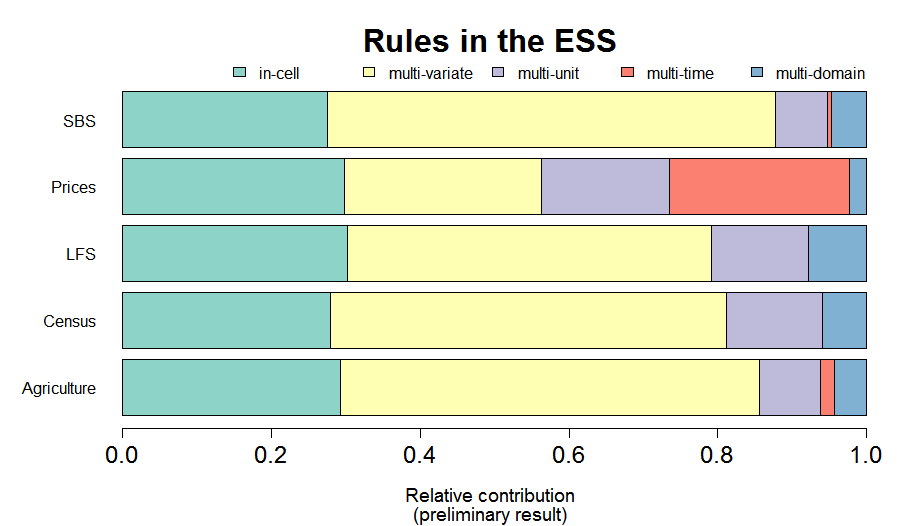

```{r, echo=FALSE}
library(validate)
companies <- read.csv("./data/input.csv")
```


## Try the code

\centering\huge

`03valid/check_validity.R`


## Data validation

Verify that data satisfy technical restrictions and does not contradict
expert knowledge.


### Examples of technical demands

- Number of records must equal 60
- Financial variables are numeric
- Records have a unique `id`
- Zipcode consists of 4 numbers followed by 2 letters 

### Examples of domain knowledge demands

- turnover is nonnegative
- turnover $-$ costs $=$ profit
- profit not larger then 60\% of turnover
- average profit is larger than 0
- average profit differs less than 10% from last year's average

## Data validation rules

A domain specific language to express demands.

### Why?

- Communicate data quality without ambiguities
- Make knowledge explicit and organize it
- Create custom data quality reports
- Reuse ruleset for data cleaning purposes

### How?

```{r, eval=FALSE}
library(validate)
companies <- read.csv("02input/input.csv",stringsAsFactors = FALSE)
rules     <- validator(.file="02input/rules.R")
result    <- confront(companies, rules)
```

## Core concepts of the `validate` package


\begin{center}
\includegraphics[height=90mm]{fig/diagram.png}
\end{center}

## Comparing numbers


```{r}
rules <- validator(turnover + costs == profit)
summary( confront(companies, rules) )
```


## Data validation: informal definitions

### Data validation

Check if a value, or combination of values is in a certain set
of valid values or valid value combinations.

### Data validation language in `validate`

Any R expression that results in a `logical`.

## Expressions that are validation rules

### Basic syntax

- Any type check: `is.numeric`, `is.character`,$\ldots$
- Any comparison: `<, <=, ==, identical !=, %in%, >=, >`
- Logical operators `|, &, if, !, all, any`
- Pattern match: `grepl`


### Sugar

Dot "`.`" stands for the whole data set:
```{r, eval=FALSE}
nrow(.) >= 50       # at least 40 rows
"id" %in% names(.)  # 'id' must be present
```

More, see `?syntax` or `vignette("introduction", package="validate")`


## Challenges

1. Express the following restrictions on `companies`. Then `confront` and `summary`
    - profit does not exceed 60% of turnover
    - turnover minus costs equals profit
    - Average profit is larger than zero
    - correlation (`corr`) between total cost and staff exceeds 0.5
    - zipcode is 4 numbers followed by two upper case letters (you need to know regex)
2. Read the rules in `rules.R`. Then, `confront`, and `summary`. 


## More on validation


- Precise definition
- Classification of validation rules

# Data Validation

## Some examples from a survey amongst the ESS member states

- If a respondents has _income from other activities_, fields under
_other activities_ must be filled.
- _Yield per area_ must be between 40 and 60 metric tons
- A person of _age_ under 15 cannot _take part in an economic activity_
- The field _type of ownership_ (of a building) may not be empty
- The _regional code_ must be in the code list.
- The _current average price_ divided by _last period's average price_ must
lie between 0.9 and 1.1.


\note{
- Some definitions are extensive (i.e. code list)
- Most of them are intensive (all others)
- Some entail a single variable (yield/area)
- Often they entail multiple variables.
- There is no mentioning of procedure. (could be manually checked!)
}


## Specification of allowed (valid) data


### By extension

_Marital status_ must be in  
$\{\texttt{never married}, \texttt{married}, 
\texttt{divorced},\texttt{widowed}\}$


### By intension

- _Age_ is a _number_ which is not negative and less than or equal to 120.
- (_Age_,_Has\_Job_) is a pair from $\mathbb{R}\times \{\texttt{yes},\texttt{no}\}$,
satisfying the implication $Age<15\Rightarrow Has\_Job = \texttt{no}$.


## Questions

- Can we properly _define_ the concept of data validation?
- If so, is it possible to _classify_ validation activities?


## Definition (European Statistical System)

### Definition

Data Validation is an activity verifying whether or not a combination of values
is a member of a set of acceptable combinations.

\small{}\hfill{}Methodology of Data Validation (ESS Handbook, 2016)\normalfont{}


## Combinations of values

### Single variable; multiple variables

$Age \geq 0$; $Age<15\Rightarrow Has\_Job = \texttt{no}$

### Multiple entities

$\textsf{mean}(Profit) \geq 10$

### Multiple times or domains

$0.9<\textsf{mean}(Profit_{2018})/\textsf{mean}(Profit_{2017}) <1.1$


## Conclusion

### Intuitively:

'Data validation is a function that accepts (some set of) 
value(s) and returns \texttt{TRUE} (valid) or \texttt{FALSE} (invalid).'


### The catch

To make this precise we must define 'some set of values'.


## What characterizes a data point?

\begin{center}
\includegraphics[height=\textheight, angle=88]{fig/output.pdf}
\end{center}


## What is a data point?

### Definition

A _data point_ consists of a pair $(k,x)$ where

- $x$ is a _value_ (number, text, category, date/time, NA)
- $k$ is a _key_ (or list of keys) identifying at least:
    - population $U$
    - time of measurement $\tau$ (or: the measurement event)
    - element of the population $u$
    - property being measured $X$
- For formal reasons, we demand that there are only a finite number
of possible keys $k$, coming from a set $K$.
- We say that $x$ comes from a domain $D$.


## What is a data set?

### Definition

A _data set_ $S$ is a finite set of key-value pairs
$$
S = \{(k_1,x_1),(k_2,x_2),\ldots, (k_{|K|},x_{|K|})\}
$$
where all $k_i$ are different.

### Note

- The $k_i$ are often referred to as _metadata_
- The $x_i$ may be of different type
- Given a set of keys $K$ and a domain $D$. The set of all data
sets is denoted $D^K$.

## Example

In 2017 we asked the Dutch company 'Piet's Bakery' for its turnover and whether it
owns the building it works in.

### Domain $D$

Numbers or yes/no: $D = \mathbb{R}\cup\{\texttt{yes},\texttt{no}\}$


### Example data points $(k=[U,\tau,u,X], x)$

- $([\textrm{Dutch Companies},2017,\textrm{Piet's Bakery}, turnover], 50.000)$
- $([\textrm{Dutch Companies},2017,\textrm{Piet's Bakery}, owns\_building],\texttt{no} )$


## Quizz

In September 2018 we ask the two Dutch citizens \textbf{A}lice and \textbf{B}ob:

1. $X$: Do you have a job? (\texttt{yes}, \texttt{no})
2. $Y$: What is your age? (\texttt{under-aged}, \texttt{adult}, \texttt{retired})

### Questions

1. Describe $D$
2. Give all values of $k$ (this constitutes $K$)
3. How many data sets are possible?

## Answers (1)

Each data point is either in $\{\texttt{yes},\texttt{no}\}$ or in
$\{\texttt{under-aged}, \texttt{adult}, \texttt{retired}\}$, so

\begin{align*}
D &= \{\texttt{yes},\texttt{no}\}\cup \{\texttt{under-aged}, \texttt{adult}, \texttt{retired}\}\\
&=\{\texttt{yes},\texttt{no}, \texttt{under-aged}, \texttt{adult}, \texttt{retired}\}
\end{align*}

## Answers (2)

- $U$: Dutch citizens (same for all data points)
- $\tau$: 2017 (same for all data points)
- Values for $k$: 
    - $[U,\tau,\textrm{Alice},\textrm{job}]$
    - $[U,\tau,\textrm{Alice},\textrm{age}]$
    - $[U,\tau,\textrm{Bob},\textrm{job}]$
    - $[U,\tau,\textrm{Bob},\textrm{age}]$


## Number of data sets: unrestricted


- There are 4 unique keys in $K$
- For each key in $K$ there are 5 options.
- Number of data sets: $5^4$ = 625.

### Note

This includes cases where values are swapped (e.g. $age=\texttt{no}$ and
$job=\texttt{under-aged}$)


## Number of data sets: with restrictions

### Restrictions

- $job \in\{\texttt{yes},\texttt{no}\}$
- $age\in\{\texttt{under-aged},\texttt{adult},\texttt{retired}\}$
- $job=\texttt{yes}\Rightarrow age = \texttt{adult}$


Number of ways for $(job, age)$ pairs to be valid equals 4:

\begin{center}
\small
\begin{tabular}{r|c|c|c|}
             & \textbf{under-aged} & \textbf{adult} & \textbf{retired}\\
    \hline
\textbf{yes} & invalid    & valid & invalid\\
    \hline
\textbf{no}  & valid      & valid & valid\\
\hline
\end{tabular}
\end{center}

There are two such pairs in a data set so there are $4^2=16$ valid data sets.


## What is data validation?

### Definition

A _data validation function_ is a surjective function $v$ that accepts a data
set in $D^K$ and returns a value in $\{\texttt{FALSE},\texttt{TRUE}\}$.

- If $v(S) = \texttt{FALSE}$ then $S$ _violates_ $v$
- If $v(S) = \texttt{TRUE}$ then $S$ _satisfies_ $v$
- Surjective means that if we compute $v$ for every possible dataset $S$, both
$\texttt{FALSE}$ and $\texttt{TRUE}$ have to occur at least once.

### Note

Such a function is (almost) always stated as a _rule_ stating a condition that
data must satisfy.


## Validation rule complexity

### Observation

Depending on the rule, we may need to compare data points 
against

- A constant,
- Other data points, coming from other
    - variables,
    - measurement times,
    - statistical units,  
    - populations.

### Idea

Use the `amount of extra information necessary' to classify the
complexity of validation rules.


## Classifying validation rules

- Recall the $U\tau uX$ notation
- A rule is labeled with a sequence of four characters $cccc$, where each
  character is either $s$ (single) or $m$ (multi).

### Example

**IF** $age < 15$ **THEN** $job=\texttt{FALSE}$ 

- We see that
    - single population $U$
    - single measurement time $\tau$
    - single statistical unit $u$
    - multiple (2) variables $X$
- Hence, the complexity class is $sssm$


## Possible classes

- In principle there are $2^4=16$ classes
- However,
    - Given $U$, the possible $u$ are known
    - Given $U$, the possible $X$ are known
- This limits the classification to 10 possible options

$$
\begin{array}{ccccc}
ssss & sssm & ssms& ssmm& smss \\
smsm & smms & smmm& msmm& mmmm.
\end{array}
$$


## Validation rule classification


\begin{center}
\begin{tabular}{|ccccc|}
\hline
\multicolumn{5}{|c|}{Validation level}\\
0 & 1 & 2 & 3 & 4\\
\hline
ssss & sssm & ssmm & smmm & mmmm \\
     & ssms & smsm & msmm &      \\
     & smss & smms &      &      \\
\hline
\end{tabular}
\end{center}


## Validation rules in the ESS (1/3)

\begin{center}
\includegraphics[height=0.7\textheight]{fig/relative.png}
\end{center}

## Validation rules in the ESS (2/3)

[]()


## Validation rules in the ESS (3/3)

\begin{center}
\includegraphics[height=\textheight]{fig/bytype.png}
\end{center}


## Quizz (1)

What is the $U\tau uX$ $s$ingle/$m$ulti classification of the following rule?

$$
\textrm{mean}(price) \geq 1  
$$

## Quizz (2)

What is the $U\tau uX$ $s$ingle/$m$ulti classification of the following rule?

$$
\frac{\textrm{mean}(price_{2018})}{\textrm{mean}(price_{2017})} \leq 1.1  
$$

## Quizz (3)

What is the $U\tau uX$ $s$ingle/$m$ulti classification of the following rule?

$$
\max\left(
\frac{x}{\textrm{median}(X)},\frac{\textrm{median}(X)}{x}
\right) < 10
$$

## Quizz (4)

What is the $U\tau uX$ $s$ingle/$m$ulti classification of the following rule?

$$
\underbrace{COE + GOS + GMI + T_{P\&M} - S_{P\&M}}_{\textrm{GDP, Income approach}} = 
\underbrace{C + G + I + (X - M)}_{\textrm{GDP, expenditure approach}}
$$

\scriptsize{}

- $COE$: Compensation of employees
- $GOS$: Gross operating surplus
- $GMI$: Gross mixed income
- $T_{P\&M}-S_{P\&M}$: Taxes minus subsidies on production and import
- $C$: Consumption by households
- $G$: Government consumption & investment
- $I$: Gross private domestic investment
- $X-M$: Export minus Imports of goods and services

\normalfont{}


